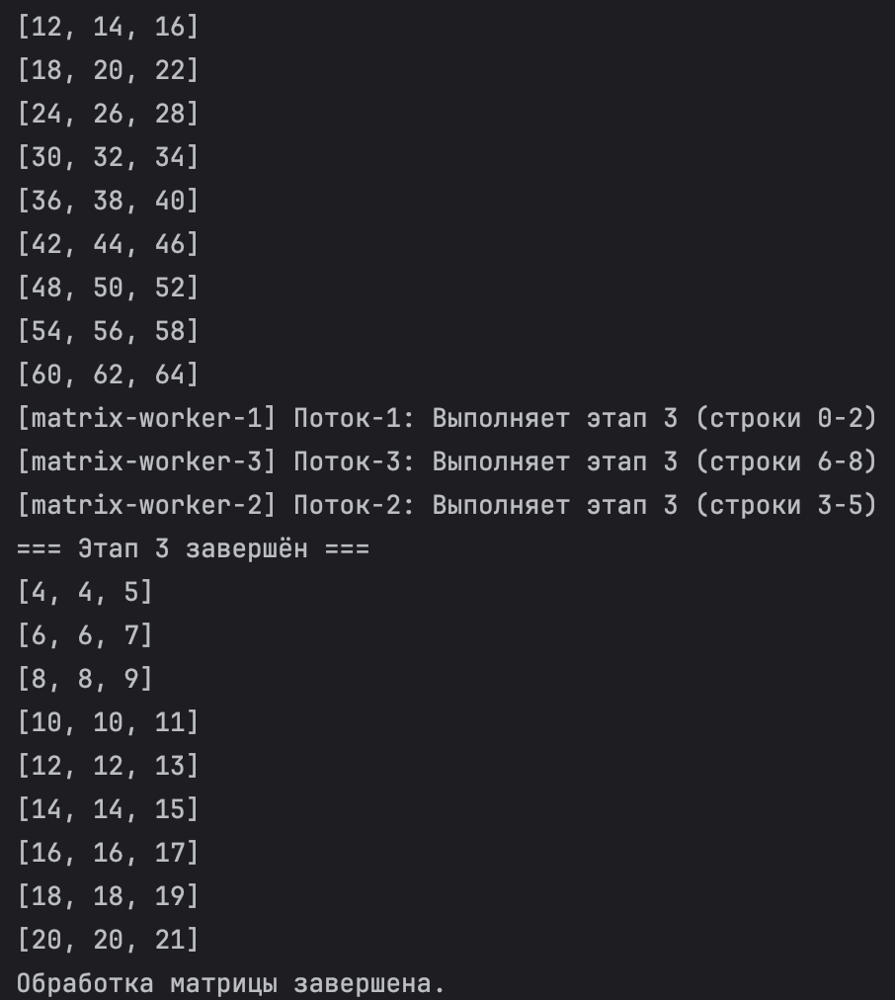

# Лабораторная работа 11: Синхронизаторы в Java

**Студент:** Сорокин Александр  
**Группа:** КИ  
**Дата:** 11.11.2025


## Цель работы
Изучить и применить основные синхронизаторы `java.util.concurrent`: `Semaphore`, `CountDownLatch`, `CyclicBarrier`.

## Структура проекта

```
Lab11_Synchronizers/
├── src/
│   ├── task1/
│   │   └── PrinterManager.java
│   ├── task2/
│   │   └── DataLoader.java
│   └── task3/
│       └── MatrixProcessor.java
└── README.md
```

## Выполненные задания

### Задание 1: Semaphore — Управление принтерами
- 3 принтера, 7 сотрудников (по одному принтеру на поток).
- Использован `Semaphore` с 3 разрешениями и честной политикой планирования (fair = true).
- Печать занимает 1–3 секунды; освобождение разрешения — в `finally`.
- Класс запуска: `task1.PrinterManager`.

### Задание 2: CountDownLatch — Загрузка данных
- 4 источника: БД, конфигурация, кэш, API.
- Главный поток ждёт `CountDownLatch(4)`; каждый загрузчик делает `countDown()` по завершении.
- Класс запуска: `task2.DataLoader`.

### Задание 3: CyclicBarrier — Матричные вычисления
- Матрица 9×3 со значениями 1..27, 3 потока по 3 строки.
- Этапы: ×2 → +10 → /3. После каждого этапа - синхронизация на `CyclicBarrier`.
- `barrierAction` печатает номер завершённого этапа и матрицу.
- Класс запуска: `task3.MatrixProcessor`.

## Инструкция по запуску (JDK 21+)

Из корня проекта:
```bash
# Компиляция
javac src/task1/PrinterManager.java src/task2/DataLoader.java src/task3/MatrixProcessor.java

# Запуск заданий
java -cp src task1.PrinterManager
java -cp src task2.DataLoader
java -cp src task3.MatrixProcessor
```
## Примеры вывода

**Задание 1:**


**Задание 2:**


**Задание 3 (фрагмент):**




## Выводы
- `Semaphore` удобен для ограничения одновременного доступа к фиксированному числу ресурсов.
- `CountDownLatch` прост для одноразовой координации завершения набора задач.
- `CyclicBarrier` позволяет организовывать этапные (циклические) вычисления, где группе потоков нужно регулярно «собираться» в синхро-точке.
- Важны обработка `InterruptedException` и освобождение ресурсов в `finally`.

